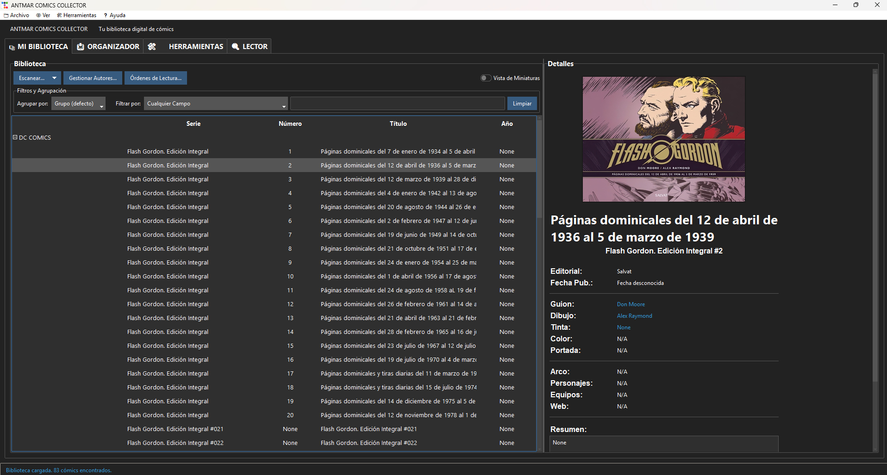
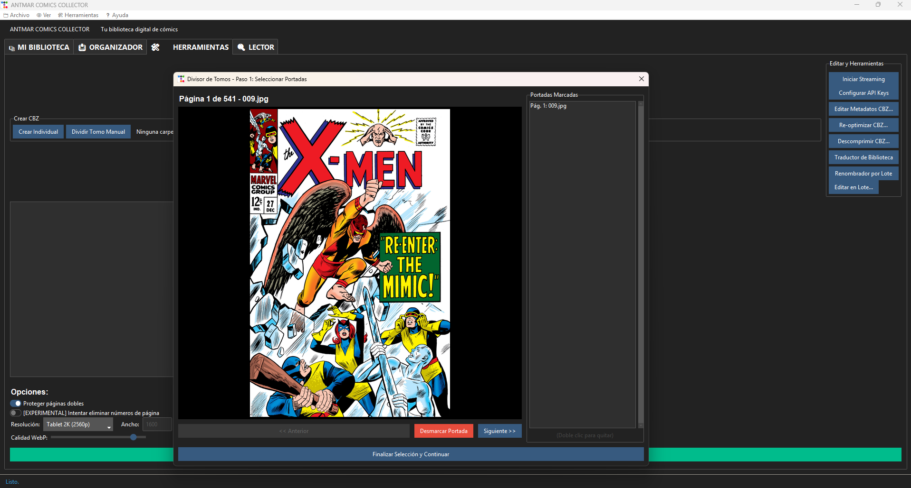

# 🦸‍♂️ Antmar Comic Collector

**Antmar Comic Collector** nació como un proyecto personal para adaptar mi propia colección de cómics.  
Quería transformar mis **tomos recopilatorios** en **números individuales** idénticos a las ediciones originales USA, pero **manteniendo el idioma español**.  
Todo comenzó como un pequeño script que dividía carpetas con imágenes… y terminó convirtiéndose en un **gestor y organizador de cómics digital completo**, hecho a medida para coleccionistas exigentes.

---

## 🎯 Objetivo

Unificar, **organizar** y enriquecer cómics digitales **en formato CBZ**, con herramientas que un coleccionista realmente necesita:

- Dividir tomos recopilatorios en números individuales.  
- Obtener y editar metadatos desde **ComicVine** y otras fuentes.  
- Extraer información de **Whakoom** mediante un scraper propio.  
- Generar y actualizar automáticamente los archivos `ComicInfo.xml`.  
- Inyectar los metadatos dentro de los archivos CBZ.  
- **Organizar automáticamente las carpetas y archivos de tu colección**, según serie, volumen o editorial.  
- Visualizar portadas, logotipos, editoriales y series.  
- Gestionar tu biblioteca de forma **local, segura y sin conexión**.

---

## ⚙️ Instalación

Descarga la última versión portable desde la pestaña **[Releases](../../releases)**  
y ejecútala directamente:

> 💡 No requiere instalación ni permisos de administrador.  
> Funciona en Windows 10 y 11.

---

## 🧩 Características principales

- Interfaz moderna (Tkinter + ttkbootstrap).  
- Integración con ComicVine (API oficial).  
- Scraper interno para extraer datos de Whakoom.  
- Generación automática de metadatos `ComicInfo.xml`.  
- Inyección directa en archivos CBZ.  
- **Organización inteligente** de cómics descargados o importados.  
- Vista rápida de portadas y editoriales.  
- Base de datos local guardada en `%APPDATA%\AntmarComicCollector`.  
- 100% funcional sin conexión a internet.

---

## 🧠 Origen

El proyecto fue creado inicialmente para uso personal por **Antonio María (Antmar)**,  
como una herramienta casera que fue creciendo versión tras versión,  
hasta convertirse en un gestor completo adaptado a las necesidades reales de los coleccionistas.

---

## 📦 Estado actual

La versión **1.0** es completamente funcional en modo portable.  
Permite gestionar, ordenar y documentar bibliotecas grandes sin instalación ni dependencias externas.

---

## 🖼️ Capturas de pantalla

### 📚 Biblioteca y detalles de cómics  
Vista general de la biblioteca con metadatos, portadas y filtros por serie, editorial o número.  

### ✂️ Divisor de tomos y creador de CBZ individuales  
Herramienta que permite dividir tomos recopilatorios en números individuales idénticos a los originales.  

---

## 🔮 Próximas mejoras

- Búsqueda avanzada en la biblioteca.  
- Lectura integrada de CBZ.  
- Integración con bases de datos locales de editoriales españolas.  
- Sincronización opcional con Whakoom y ComicVine.  
- Exportación de bibliotecas a HTML o PDF.  

---

## 🧾 Licencia

Este proyecto se distribuye con fines educativos y personales.  
Todos los derechos de los cómics, logotipos y metadatos pertenecen a sus respectivos autores y editoriales.
